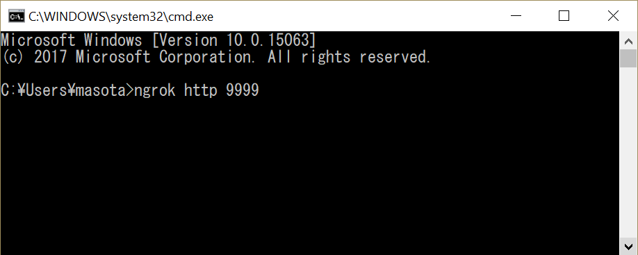
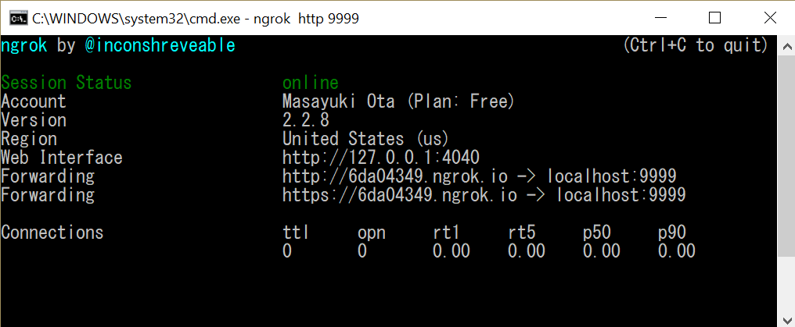
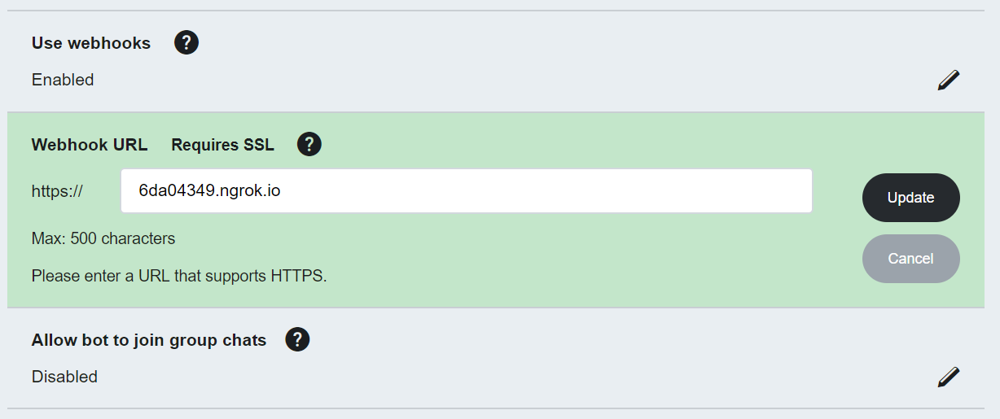
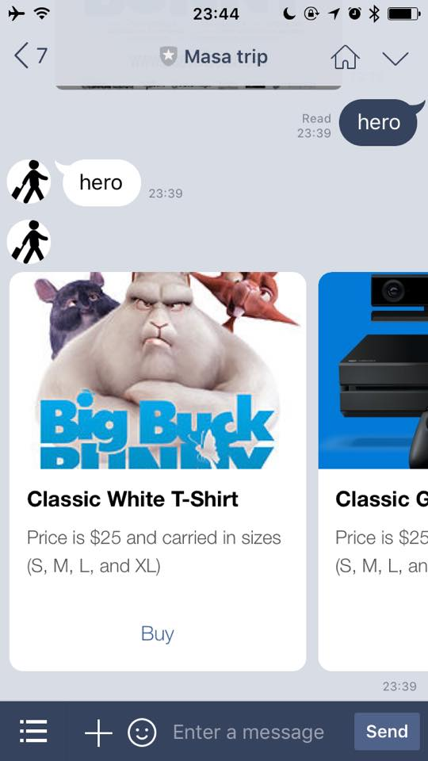

# How to connect LINE and Microsoft Bot Framework
- If you are starter for LINE bot, please see `How to get going with LINE`
- If you want to do local debug, please follow `Local debug`

## Local debug
1. [Make bot with Microsoft Bot Framework](https://docs.microsoft.com/en-us/bot-framework/bot-builder-overview-getstarted)
2. Publish Bot to Cloud. If you use Microsoft Azure, please follow [this tutorial](https://docs.microsoft.com/en-us/bot-framework/deploy-bot-overview).
3. [Connect a bot to Direct Line channel](https://docs.microsoft.com/en-us/bot-framework/channel-connect-directline) and get secret key.
4. Clone this repo and insert your `Direct Line secret key`, `LINE Channel secret` and `LINE Channel access token` in index.ts.
5. Open your bash or command prompt and type `npm run dev` to run bot.
6. Install and setup [ngrok](https://ngrok.com/) for tonneling LINE webhook to local debug environment.
7. In your bash or command prompt type `ngrok http 9999`.

8. Copy https url. In the screen shot below, please copy `https://6da04349.ngrok.io`

9. Open your bot setting in [LINE Developer page](https://developers.line.me) and update your webhook url.

10. This is a time to send message to LINE. Please send test message, then you will get LINE message like this.

## Deploy in production
We are making instraction for Azure, but you can delopy this app to your own cloud environment and can connect Bot Framework and LINE.

## How to get going with Line

1. Download the line app and sign up for line, if you don't have an account yet

2. Make sure you set up an email address and passwort for line, for example if you signed with facebook (App -> Settings -> Account)

3. Create LINE Business account
    * [LINE BUSINESS CENTER](https://business.line.me)
    * Messaging API -> Developer Trial

3. Get you account set up and get the channel access token
    * LINE BUSINESS CENTER > Accounts > Your Account > Messaging API > Line Developers
    * Create and save you Channel Access Token

4. Whitelist your server or dev machine
    * To send messages to the the line messages endpoint you need to whitelist you local dev machines or server where you run you bot or connector
    * [Line Developers Portal](https://developers.line.me/ba) -> Server IP Whitelist

5. Set up your webhook URL for line
    * [Line Developers Portal](https://developers.line.me/ba) -> Edit -> Webhook URL
    * You will need to set an https endpoint
    * After saving the Webhook you can go back and click verify to test you endpoint

6. Connect the your Webhook to your Line account / Bot
    * Visit the [Line@ Manager] -> Your Account -> Setting -> Messaging API -> Settings -> Use Webhooks -> Allow 

## Links

* [Simple LINE Bot in Node.js](https://github.com/sakkuru/line-bot-nodejs)